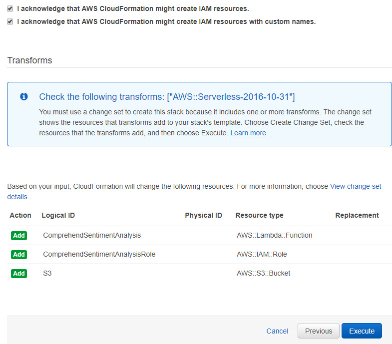
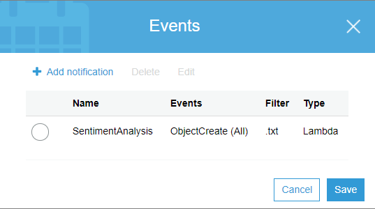

# Detect sentiment from customer reviews using Amazon Comprehend

 In today’s world, public content has never been more relevant. Data from customer reviews is being used as a tool to gain insight into consumption-related decisions as the understanding of its associated sentiment grants businesses invaluable market awareness and the ability to proactively address issues early.

Sentiment analysis uses a process to computationally determine whether a piece of writing is positive, negative, neutral, or mixed. Amazon Comprehend is a natural language processing (NLP) text analytics service made up of a handful of APIs that allows you to detect sentiment (along with key phrases, named entities, and language) and perform topic modeling from a collection of documents. The service’s ability to detect sentiment is done using state-of-the-art deep learning algorithms that use scoring mechanisms and attributes during the evaluation of text. The Amazon Comprehend training data set primarily consists of data found in product descriptions and consumer reviews from one of the largest natural language collections in the world — Amazon.com. We give you a fully trained model that continuously retrains against new data to keep pace with the evolution of language. ML in general requires a different skillset than most data engineers and developers currently have. Amazon Comprehend has removed this gap and made NLP easy to consume using the skills developers already have.

In this blog post, we will show you how to leverage Amazon Comprehend as part of a serverless event driven architecture, built with AWS services, to detect customer sentiment. 

<em> Solution Architecture Overview </em>

Let’s take a look at product reviews on Amazon.com and use Amazon Comprehend to classify the sentiment for a given review. We will use the Amazon Echo, Amazon Echo Dot, and the Amazon Echo Show reviews as examples. We will then upload additional fake sample data, in an attempt to prevent tarnishing a brand, and simulate retrieving negative product sentiment with nuanced information such as defective, damaged, or hazardous items that are on recall. Finally, we will place the business in a position to take immediate action by using Amazon Athena to interactively query for the negative reviews and export the report.

Review Upload: User will upload customer review in text format to the Customer Review bucket. 

Customer Review Sentiment Analysis Function: The secure review upload is used as an Amazon S3 event to trigger the Review Sentiment Analysis function that downloads the review to a temporary file, calls Amazon Comprehend to run text analytics against it, and then outputs the overall sentiment along with the positive, negative, neutral, and mixed confidence scores to a CSV file. The CSV file with the sentiment is stored in a sentiment folder of the same Customer Review bucket.

Interactive SQL Query:  Amazon Athena is used to query the review results and focus in on the negative sentiment.

Step by Step Configuration
We will start off by deploying an AWS CloudFormation template to provision the necessary AWS Identity and Access Management (IAM) role and Lambda function needed in order to interact with the Amazon S3, AWS Lambda, and Amazon Comprehend APIs.

[1] In the CloudFormation console, choose the Launch Stack button (above). If interested, you can view the YAML template here.
[2] Choose Next on the Select Template page.
[3] Choose Next on the Specify Details page.
[4] On the Options page, leave all the defaults and Choose Next.
[5] On the Review page, check the boxes to acknowledge that CloudFormation will create IAM resources and IAM resources with customer names.
[6] Choose Create Change Set.

Note: The CloudFormation template we’ve provided is written using AWS Serverless Application Model (AWS SAM). AWS SAM simplifies how to define functions, APIs, etc. for serverless applications, as well as some features for these services like environment variables. When deploying SAM templates in CloudFormation template, a transform step is required to convert the SAM template into standard CloudFormation, thus you must choose the Create Change Set button to make the transform happen.

[7] Wait a few seconds for the change set to finish computing changes. Your screen should look as follows:

[8] Finally, choose Execute and then let the CloudFormation launch resources in the background. You don’t need to wait for it to finish before proceeding to the next step.

<em> Amazon Simple Storage Service (S3) bucket event trigger: </em>

Now that you have your IAM role, Lambda function, and S3 bucket deployed, let’s make sure that we create an S3 event trigger for your Comprehend Sentiment Analysis function.

[1] Open the Amazon S3 console and select new S3 bucket that begins with ‘review-sentiment.’
[2] Choose the Properties Under the Advanced Settings section, choose the Events box.
[3] Choose + Add notification and configure the following:
  (a) Name: SentimentAnalysis
  (b) Events: ObjectCreate (All)
  (c) Suffix: .txt
  (d) Send to: Lambda Function
  (e) Lambda: review-sentiment-ComprehendSentimentAnalysis-XYZ
[4] Choose Save.

