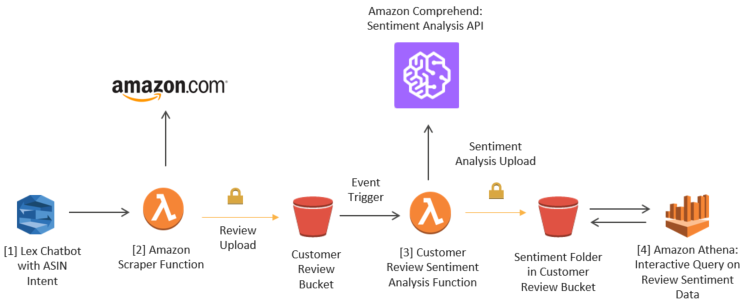

# Detect sentiment from customer reviews using Amazon Comprehend

 In today’s world, public content has never been more relevant. Data from customer reviews is being used as a tool to gain insight into consumption-related decisions as the understanding of its associated sentiment grants businesses invaluable market awareness and the ability to proactively address issues early.

Sentiment analysis uses a process to computationally determine whether a piece of writing is positive, negative, neutral, or mixed. Amazon Comprehend is a natural language processing (NLP) text analytics service made up of a handful of APIs that allows you to detect sentiment (along with key phrases, named entities, and language) and perform topic modeling from a collection of documents. The service’s ability to detect sentiment is done using state-of-the-art deep learning algorithms that use scoring mechanisms and attributes during the evaluation of text. The Amazon Comprehend training data set primarily consists of data found in product descriptions and consumer reviews from one of the largest natural language collections in the world — Amazon.com. We give you a fully trained model that continuously retrains against new data to keep pace with the evolution of language. ML in general requires a different skillset than most data engineers and developers currently have. Amazon Comprehend has removed this gap and made NLP easy to consume using the skills developers already have.

In this blog post, we will show you how to leverage Amazon Comprehend as part of a serverless event driven architecture, built with AWS services, to detect customer sentiment. 

<em> Solution Architecture Overview </em>

Let’s take a look at product reviews on Amazon.com and use Amazon Comprehend to classify the sentiment for a given review. We will use the Amazon Echo, Amazon Echo Dot, and the Amazon Echo Show reviews as examples. We will then upload additional fake sample data, in an attempt to prevent tarnishing a brand, and simulate retrieving negative product sentiment with nuanced information such as defective, damaged, or hazardous items that are on recall. Finally, we will place the business in a position to take immediate action by using Amazon Athena to interactively query for the negative reviews and export the report.

Review Upload: User will upload customer review in text format to the Customer Review bucket. 

Customer Review Sentiment Analysis Function: The secure review upload is used as an Amazon S3 event to trigger the Review Sentiment Analysis function that downloads the review to a temporary file, calls Amazon Comprehend to run text analytics against it, and then outputs the overall sentiment along with the positive, negative, neutral, and mixed confidence scores to a CSV file. The CSV file with the sentiment is stored in a sentiment folder of the same Customer Review bucket.

Interactive SQL Query:  Amazon Athena is used to query the review results and focus in on the negative sentiment.

<strong>  Step by Step Configuration can be found on the AWS Machine Learning Blog <a href="https://aws.amazon.com/blogs/machine-learning/detect-sentiment-from-customer-reviews-using-amazon-comprehend/"> here </a> <strong> 

Conclusion
In summation, Amazon Comprehend gives you deep insight into customer feedback by allowing shifting opinions and overall sentiment to be identified quickly, which reduces the time and effort to understand customers. This also presents the opportunity for immediate adaptations to be applied in order to meet the dynamically changing needs of customers.

Training NLP is difficult and can be very expensive. There are many obstacles in the path to capturing true sentiment, such as language ambiguity through cryptic dialogue, sarcasm, and irony, as well as the symbolic expressions of emoji’s which may not be analyzed in a pure text capture. All of these obstacles can make sentiment more difficult to understand and, therefore, may impact the quality of result you receive. Even with a large data set of unstructured sentiment rich-text and the right analytics, successfully reacting to or predicting customer needs can take a considerable amount of effort. This requires businesses to possess the skills and expertise required to build efficient machine learning (ML) models that contain the optimal algorithms used to train accurate sentiment classifiers and then apply ML techniques to further reduce systematic inaccuracies while improving upon the model over time through continuous feedback loops.

Amazon Comprehend abstracts the undifferentiated heavy lifting needed from data scientist and allows you to easily integrate the service into your application or analytics solutions. In addition, you can query millions of reviews at a time on AWS and then present only the relevant information. There are many ways to gather textual information outside of our use case, such as performing real time ingestion of data via Amazon Kinesis or scheduled events in Amazon CloudWatch. Furthermore, there are many other insights you can gain into your textual data once you’ve extracted and analyzed sentiment. For example, you can load new strings of your data into your data warehouse such as Amazon Redshift, view the data within a Business Intelligence (BI) tool such as Amazon QuickSight or copy negative sentiment reviews into an S3 bucket that triggers our Simple Notification Service (SNS) to notify your customer service team.

Doing all of this in a serverless architecture allows you to write and run code without ever thinking about servers. After all, writing business logic should be the only code you write. As always, we will continue to iterate on our models in true agile fashion. Please keep the feedback coming. Now let your imagination run free and go #BuildOnAWS!
